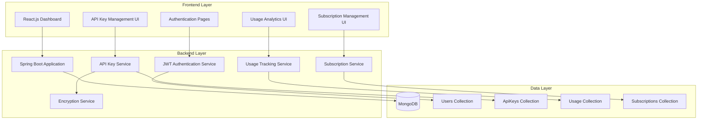

# Design Document

## Overview

The Secure API Key Management & Usage Tracking Platform is designed as a full-stack web application with a React.js frontend, Spring Boot backend, and MongoDB database. The architecture emphasizes security through encryption, JWT-based authentication, and secure communication protocols. The system follows a RESTful API design pattern with clear separation of concerns between presentation, business logic, and data persistence layers.

## Architecture

### High-Level Architecture



### Security Architecture

The platform implements multiple layers of security:

1. **Transport Security**: HTTPS for all client-server communication
2. **Authentication**: JWT tokens with configurable expiration
3. **Data Encryption**: AES-256 encryption for API keys at rest
4. **Password Security**: BCrypt hashing with salt for user passwords
5. **Authorization**: User-scoped data access with JWT validation

## Components and Interfaces

### Frontend Components

#### Authentication Module
- **LoginComponent**: Handles user login with email/password validation
- **RegisterComponent**: Manages user registration with form validation
- **AuthGuard**: Protects routes requiring authentication
- **AuthService**: Manages JWT tokens and authentication state

#### Dashboard Module
- **DashboardLayout**: Main layout with sidebar navigation
- **ApiKeysList**: Displays user's API keys with management actions
- **UsageAnalytics**: Shows usage charts and statistics
- **SubscriptionManager**: Manages subscription details and limits

#### Shared Components
- **LoadingSpinner**: Consistent loading states
- **AlertNotification**: User feedback and error messages
- **ConfirmDialog**: Confirmation for destructive actions

### Backend Services

#### Authentication Service
```java
@Service
public class AuthenticationService {
    public AuthResponse authenticate(LoginRequest request);
    public AuthResponse register(RegisterRequest request);
    public boolean validateToken(String token);
    public String generateToken(User user);
}
```

#### API Key Service
```java
@Service
public class ApiKeyService {
    public ApiKeyResponse createApiKey(CreateApiKeyRequest request, String userId);
    public List<ApiKeyResponse> getUserApiKeys(String userId);
    public ApiKeyResponse updateApiKey(String keyId, UpdateApiKeyRequest request);
    public void deleteApiKey(String keyId, String userId);
    public void toggleApiKeyStatus(String keyId, String userId);
}
```

#### Usage Tracking Service
```java
@Service
public class UsageTrackingService {
    public void recordUsage(String keyId);
    public UsageStatsResponse getUsageStats(String keyId, DateRange range);
    public List<UsageAlertResponse> getUsageAlerts(String userId);
}
```

#### Encryption Service
```java
@Service
public class EncryptionService {
    public String encryptApiKey(String plainKey);
    public String decryptApiKey(String encryptedKey);
    public String hashPassword(String plainPassword);
    public boolean verifyPassword(String plainPassword, String hashedPassword);
}
```

### REST API Endpoints

#### Authentication Endpoints
- `POST /api/auth/register` - User registration
- `POST /api/auth/login` - User login
- `POST /api/auth/refresh` - Token refresh
- `POST /api/auth/logout` - User logout

#### API Key Management Endpoints
- `GET /api/keys` - List user's API keys
- `POST /api/keys` - Create new API key
- `PUT /api/keys/{id}` - Update API key metadata
- `DELETE /api/keys/{id}` - Delete API key
- `PATCH /api/keys/{id}/status` - Toggle key status

#### Usage Tracking Endpoints
- `POST /api/usage/{keyId}` - Record API usage
- `GET /api/usage/{keyId}` - Get usage statistics
- `GET /api/usage/alerts` - Get usage alerts

#### Subscription Management Endpoints
- `GET /api/subscriptions` - List user subscriptions
- `POST /api/subscriptions` - Add new subscription
- `PUT /api/subscriptions/{id}` - Update subscription
- `DELETE /api/subscriptions/{id}` - Remove subscription

## Data Models

### User Model
```javascript
{
  _id: ObjectId,
  name: String,
  email: String (unique, indexed),
  passwordHash: String,
  createdAt: Date,
  updatedAt: Date
}
```

### ApiKey Model
```javascript
{
  _id: ObjectId,
  userId: ObjectId (indexed),
  serviceName: String,
  description: String,
  encryptedApiKey: String,
  status: String (enum: 'active', 'inactive'),
  createdAt: Date,
  expiresAt: Date (optional),
  updatedAt: Date
}
```

### Usage Model
```javascript
{
  _id: ObjectId,
  keyId: ObjectId (indexed),
  userId: ObjectId (indexed),
  date: Date (indexed),
  callsMade: Number,
  createdAt: Date
}
```

### Subscription Model
```javascript
{
  _id: ObjectId,
  userId: ObjectId (indexed),
  serviceName: String,
  planType: String (enum: 'free', 'pro', 'enterprise'),
  monthlyLimit: Number,
  currentUsage: Number,
  expiryDate: Date,
  createdAt: Date,
  updatedAt: Date
}
```

## Error Handling

### Frontend Error Handling
- **Network Errors**: Display user-friendly messages for connection issues
- **Validation Errors**: Show field-specific validation messages
- **Authentication Errors**: Redirect to login and clear invalid tokens
- **Authorization Errors**: Display access denied messages

### Backend Error Handling
- **Global Exception Handler**: Centralized error response formatting
- **Validation Errors**: Return structured validation error responses
- **Authentication Failures**: Return 401 with clear error messages
- **Resource Not Found**: Return 404 for missing resources
- **Server Errors**: Log errors and return generic 500 responses

### Error Response Format
```json
{
  "success": false,
  "error": {
    "code": "VALIDATION_ERROR",
    "message": "Invalid input data",
    "details": {
      "field": "email",
      "message": "Email format is invalid"
    }
  },
  "timestamp": "2024-01-15T10:30:00Z"
}
```

## Testing Strategy

### Frontend Testing
- **Unit Tests**: Jest and React Testing Library for component testing
- **Integration Tests**: Test API integration and user workflows
- **E2E Tests**: Cypress for critical user journeys
- **Visual Tests**: Snapshot testing for UI consistency

### Backend Testing
- **Unit Tests**: JUnit 5 for service layer testing
- **Integration Tests**: Spring Boot Test for API endpoint testing
- **Security Tests**: Test authentication and authorization flows
- **Database Tests**: Test MongoDB operations with embedded database

### Test Coverage Goals
- **Unit Tests**: 80% code coverage minimum
- **Integration Tests**: Cover all API endpoints
- **E2E Tests**: Cover critical user workflows (login, key management, usage tracking)

### Testing Data
- **Mock Data**: Use consistent test data sets
- **Test Database**: Separate MongoDB instance for testing
- **Encryption Testing**: Verify encryption/decryption operations
- **JWT Testing**: Test token generation and validation

## Performance Considerations

### Frontend Optimization
- **Code Splitting**: Lazy load dashboard components
- **Caching**: Cache API responses where appropriate
- **Bundle Optimization**: Minimize JavaScript bundle size
- **Image Optimization**: Optimize dashboard icons and charts

### Backend Optimization
- **Database Indexing**: Index frequently queried fields (userId, keyId, date)
- **Connection Pooling**: Configure MongoDB connection pool
- **Caching**: Cache frequently accessed user data
- **Pagination**: Implement pagination for large data sets

### Security Performance
- **JWT Optimization**: Use appropriate token expiration times
- **Encryption Efficiency**: Optimize AES encryption operations
- **Rate Limiting**: Implement API rate limiting to prevent abuse
- **Session Management**: Efficient JWT token validation